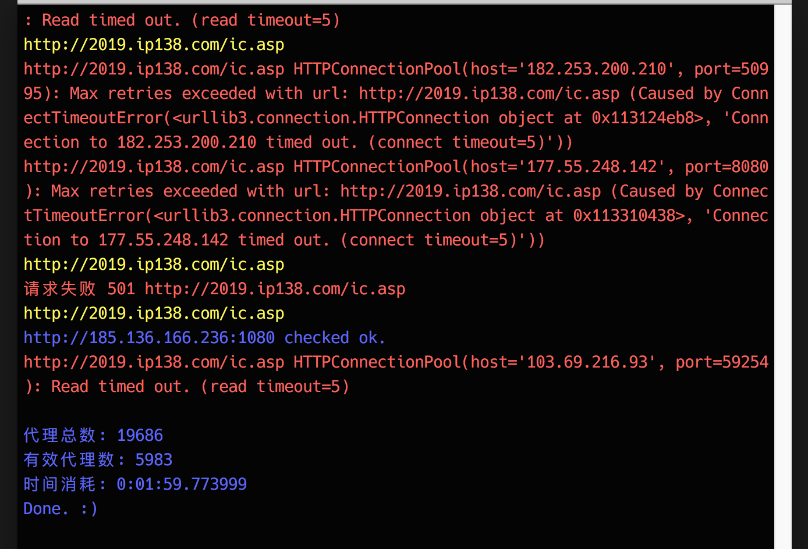

# Proxies

100行代码快速获得一个代理池

两分钟获得五六千个有效代理

爬虫需要翻墙，自行配置16行中的PROXIES

最终会把验证过的代理保存在proxies.txt里

## USAGE 使用方法

```bash
# 安装依赖库
pip3 install requests

# 运行
python3 run.py
```

## Preview


## LICENSE

WTFPL
